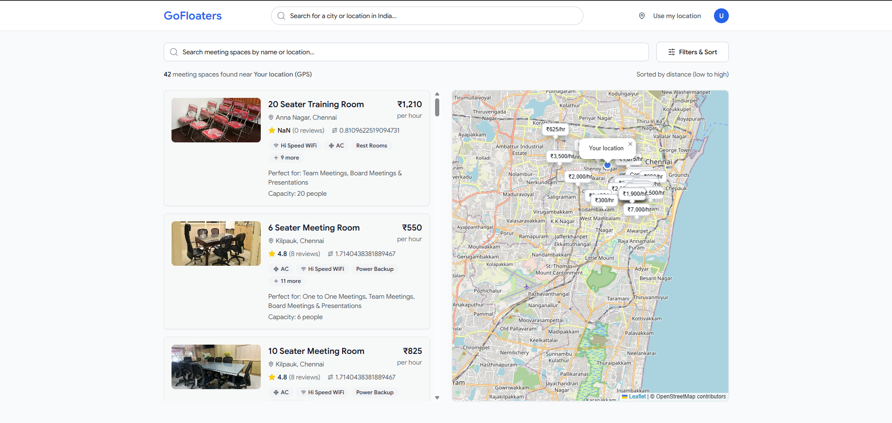

# 🏢 Meeting Space Finder Web App - Complete Technical Explanation

## 📋 Overview
Your Meeting Space Finder is a **pure frontend React application** that helps users discover and book meeting spaces and coworking locations across India. It runs entirely in the browser with no backend server required.

## 🏗️ Architecture & File Structure

### Core Application Structure
```
client/src/
├── App.tsx                 # Main app component with routing
├── main.tsx               # React app entry point
├── pages/
│   ├── home.tsx           # Main homepage with all features
│   └── not-found.tsx      # 404 page
├── components/
│   ├── space-card.tsx     # Individual workspace cards
│   ├── space-map.tsx      # Interactive map component
│   ├── location-search.tsx # City search with autocomplete
│   ├── filter-sidebar.tsx # Advanced filtering system
│   ├── location-modal.tsx # GPS permission popup
│   └── ui/               # 40+ reusable UI components
├── hooks/
│   ├── use-geolocation.tsx # GPS location management
│   └── use-toast.ts       # Notification system
└── lib/
    ├── api.ts             # Direct GoFloaters API calls
    ├── queryClient.ts     # Data caching setup
    └── utils.ts           # Helper functions
```

## 🚀 How the Web App Works

### 1. **App Initialization** (`App.tsx` + `main.tsx`)
- **React 18** powers the entire application
- **Wouter** handles client-side routing (lightweight alternative to React Router)
- **TanStack Query** manages API data caching and synchronization
- **shadcn/ui** provides 40+ beautiful, accessible UI components
- **Tailwind CSS** handles all styling with responsive design

### 2. **Main Homepage** (`pages/home.tsx`)
The homepage is the core of your app with several key areas:

#### **Smart Location Management**
- **Default Location**: Koramangala, Bengaluru (12.9304278, 77.678404)
- **GPS Detection**: Uses `use-geolocation.tsx` hook for real-time location
- **Location Modal**: Prompts users to share location on first visit
- **Manual Search**: City search with autocomplete for 100+ Indian cities

#### **Real-time Data Fetching**
```javascript
// Direct API call to GoFloaters
const apiUrl = `https://gofloaters.web.app/spaces/nearby?lat=${lat}&lng=${lng}&spaceSubType=meetingSpace`;
```

#### **Advanced Filtering System**
- Price range (₹0 - ₹5000+ per hour)
- Team size (1-20+ people)
- Facilities (WiFi, AC, Projector, etc.)
- Distance radius (up to 25km)
- Rating filter (1-5 stars)
- Sorting (distance, price, rating)

## 🗺️ Interactive Map System (`space-map.tsx`)

### **Map Technology**
- **Leaflet.js**: Open-source interactive map library
- **OpenStreetMap**: Free map tiles (no Google Maps API key needed)
- **Dynamic Loading**: Map loads on-demand to improve performance

### **Map Features**
- **User Location Marker**: Blue circle showing your position
- **Workspace Markers**: Red pins for each meeting space
- **Interactive Popups**: Click markers to see space details
- **Zoom Controls**: Custom zoom in/out buttons
- **Auto-centering**: Focuses on user location or search area

### **Technical Implementation**
```javascript
// Load Leaflet dynamically
const map = L.map(mapRef.current).setView([lat, lng], 14);
L.tileLayer('https://{s}.tile.openstreetmap.org/{z}/{x}/{y}.png').addTo(map);

// Add workspace markers
spaces.forEach(space => {
  const marker = L.circleMarker([lat, lng], {
    radius: 6,
    fillColor: selectedSpaceId === space.spaceId ? '#ef4444' : '#f97316'
  }).addTo(map);
});
```

## 💳 Workspace Cards (`space-card.tsx`)

### **Card Information Display**
Each workspace card shows:
- **High-quality images** (with fallback to stock meeting room photos)
- **Space name and location** (neighborhood, city)
- **Pricing** (₹X per hour, formatted with Indian number system)
- **Star ratings** (from Google Reviews)
- **Distance** (calculated from user location)
- **Key facilities** (WiFi, AC, projector icons with text)
- **Capacity** (number of seats available)

### **Smart Image Handling**
```javascript
// Primary image from GoFloaters API
const imageUrl = space.photos?.[0] || 
  'https://images.unsplash.com/photo-1560472354-b33ff0c44a43?ixlib=rb-4.0.3&auto=format&fit=crop&w=400&h=250';

// Fallback if image fails to load
onError={(e) => {
  e.target.src = "https://images.unsplash.com/photo-1517502884422-41eaead166d4?ixlib=rb-4.0.3&auto=format&fit=crop&w=400&h=250";
}}
```

## 🔍 Location Search System (`location-search.tsx`)

### **Intelligent City Search**
- **100+ Indian Cities**: Comprehensive database of major Indian cities
- **Autocomplete**: Type-ahead search with instant results
- **Mock Google Places**: Works without Google Maps API key
- **Real Coordinates**: Each city has accurate latitude/longitude

### **City Database Includes**
- **Tier 1 Cities**: Mumbai, Delhi, Bangalore, Pune, Hyderabad, Chennai
- **Tier 2 Cities**: Jaipur, Ahmedabad, Surat, Indore, Bhopal
- **Growing Cities**: Nashik, Vadodara, Rajkot, Faridabad, Ghaziabad

### **Technical Implementation**
```javascript
// Mock Google Places service
const mockResults = [
  { place_id: "mock_bangalore", description: "Bangalore, Karnataka, India", coordinates: [12.9716, 77.5946] },
  { place_id: "mock_mumbai", description: "Mumbai, Maharashtra, India", coordinates: [19.0760, 72.8777] },
  // ... 100+ more cities
];
```

## 📡 Data Fetching & API Integration (`lib/api.ts`)

### **Direct GoFloaters API Calls**
Your app makes direct HTTP requests to GoFloaters API:

```javascript
export async function searchNearbySpaces(params) {
  const apiUrl = `https://gofloaters.web.app/spaces/nearby?lat=${params.lat}&lng=${params.lng}&spaceSubType=meetingSpace`;
  
  const response = await fetch(apiUrl, {
    method: "GET",
    headers: { "Accept": "application/json" },
    mode: "cors"
  });
  
  return await response.json();
}
```

### **Data Processing Pipeline**
1. **API Response**: Raw JSON data from GoFloaters
2. **Data Transformation**: Convert to standard Space objects
3. **Filter Application**: Price, capacity, distance, facilities filtering
4. **Sorting**: Distance, price, or rating-based sorting
5. **UI Rendering**: Display cards and map markers

### **Smart Caching**
- **TanStack Query**: Caches API responses to reduce network calls
- **5-minute Cache**: Fresh data while avoiding redundant requests
- **Background Refetch**: Updates data when user returns to tab

## 📱 User Interface & Experience

### **Responsive Design**
- **Mobile-First**: Optimized for phones and tablets
- **Desktop Enhanced**: Full sidebar layout on larger screens
- **Touch-Friendly**: Large tap targets for mobile users

### **Interactive Features**
- **Real-time Search**: Instant results as you type
- **GPS Integration**: "Use my location" with browser geolocation
- **Filter Sidebar**: Slide-out panel with all filtering options
- **Map Synchronization**: Cards and map markers stay in sync
- **Loading States**: Smooth loading animations

### **Visual Design System**
- **Color Scheme**: Professional blue/orange theme
- **Typography**: Clean, readable fonts
- **Icons**: Lucide React icons for consistency
- **Cards**: Material design inspired workspace cards
- **Badges**: Facility tags with relevant icons

## 🔧 Browser APIs & Technologies Used

### **Browser APIs**
- **Geolocation API**: `navigator.geolocation.getCurrentPosition()`
- **Fetch API**: Direct HTTP requests to GoFloaters
- **localStorage**: User preferences and location caching

### **External Libraries**
- **Leaflet.js**: Interactive maps (`https://unpkg.com/leaflet@1.9.4/dist/leaflet.js`)
- **OpenStreetMap**: Map tiles (`https://{s}.tile.openstreetmap.org/{z}/{x}/{y}.png`)
- **Google Fonts**: Typography from Google Fonts

### **React Ecosystem**
- **React 18**: Latest React with concurrent features
- **TypeScript**: Full type safety throughout
- **Vite**: Lightning-fast development and building
- **TanStack Query**: Server state management
- **Wouter**: Lightweight routing

## ⚡ Performance & Optimization

### **Bundle Optimization**
- **Code Splitting**: Lazy loading for better performance
- **Tree Shaking**: Only includes used code
- **Minification**: Compressed JavaScript and CSS
- **Gzip Compression**: 113KB JS (from 356KB raw)

### **Loading Strategies**
- **Progressive Enhancement**: App works even if maps fail to load
- **Fallback Images**: Backup images if space photos fail
- **Error Boundaries**: Graceful error handling
- **Loading States**: Smooth user experience during data fetch


### **Build Process**
```bash
# 🚀 Development Mode
npm install           # Install all dependencies
npm run dev           # Starts the Express server with Vite in development mode
                     # Serves both API and React frontend with hot reload

# 🏗️ Production Build
./build-static.sh     # Builds the React frontend using Vite
                      # Outputs static files to /dist

# 🚀 Serve Production Build
STATIC_DEPLOY=true npm run dev
                     # Starts Express server in production mode
                     # Serves static files from /dist and handles API routes
```


## 🎯 Key Features Summary

✅ **Real-time GPS location detection**  
✅ **100+ Indian cities searchable**  
✅ **Direct GoFloaters API integration**  
✅ **Interactive map with space markers**  
✅ **Advanced filtering (price, capacity, facilities)**  
✅ **Mobile-responsive design**  
✅ **Offline-capable with localStorage**  
✅ **No backend or API keys required**  
✅ **Static deployment ready**  
✅ **Professional UI with shadcn/ui components**

## Screenshot 
<p align="center">
  
</p>
